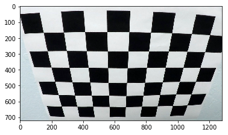
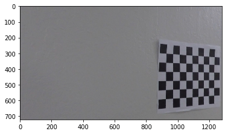
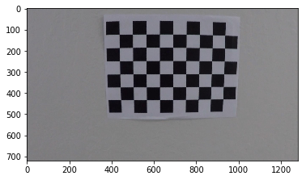
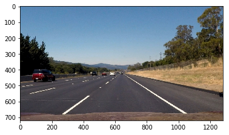
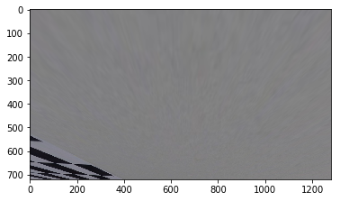
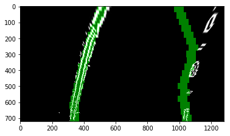

## Advanced Lane Finding

Short Overview of the  goals / steps of this project are the following:

* Compute the camera calibration matrix and distortion coefficients given a set of chessboard images.
* Apply a distortion correction to raw images.
* Use color transforms, gradients, etc., to create a thresholded binary image.
* Apply a perspective transform to rectify binary image ("birds-eye view").
* Detect lane pixels and fit to find the lane boundary.
* Determine the curvature of the lane and vehicle position with respect to center.
* Warp the detected lane boundaries back onto the original image.
* Output visual display of the lane boundaries and numerical estimation of lane curvature and vehicle position.

# Camera Calibration

Open CV is used to detect 9x6 chessboard pattern. If 9x6 chessboard pattern fails a retry with 9x5 is started. This was applyed to all Calibration Images:

    camera_cal\calibration1.jpg
    

    camera_cal\calibration10.jpg
    

    camera_cal\calibration11.jpg
    

    camera_cal\calibration12.jpg
    

    camera_cal\calibration13.jpg
    

    camera_cal\calibration14.jpg
    

    camera_cal\calibration15.jpg
    

    camera_cal\calibration16.jpg
    

    camera_cal\calibration17.jpg
    

    camera_cal\calibration18.jpg
    

    camera_cal\calibration19.jpg
    

    camera_cal\calibration2.jpg
    

    camera_cal\calibration20.jpg
    

    camera_cal\calibration3.jpg
    

    camera_cal\calibration4.jpg
    

    camera_cal\calibration5.jpg
    

    camera_cal\calibration6.jpg
    

    camera_cal\calibration7.jpg
    

    camera_cal\calibration8.jpg
    

    camera_cal\calibration9.jpg
    

# Pipeline

## Distortion-correction application

Distortion correction that was calculated via camera calibration has been applied to each image. 

    camera_cal\calibration1.jpg
    

    camera_cal\calibration10.jpg
    

    camera_cal\calibration11.jpg
    

    camera_cal\calibration12.jpg
    

    camera_cal\calibration13.jpg
    

    camera_cal\calibration14.jpg
    

    camera_cal\calibration15.jpg
    

    camera_cal\calibration16.jpg
    

    camera_cal\calibration17.jpg
    

    camera_cal\calibration18.jpg
    

    camera_cal\calibration19.jpg
    

    camera_cal\calibration2.jpg
    

    camera_cal\calibration20.jpg
    

    camera_cal\calibration3.jpg
    

    camera_cal\calibration4.jpg
    

    camera_cal\calibration5.jpg
    

    camera_cal\calibration6.jpg
    

    camera_cal\calibration7.jpg
    

    camera_cal\calibration8.jpg
    

    camera_cal\calibration9.jpg
    

    test_images\straight_lines1.jpg
    

    test_images\straight_lines2.jpg
    

    test_images\test1.jpg
    

    test_images\test2.jpg
    

    test_images\test3.jpg
    

    test_images\test4.jpg
    

    test_images\test5.jpg
    

    test_images\test6.jpg
    

## birds-eye view application

OpenCV functions has been used rectify each image to a "birds-eye view". The transform manages Regtion of Interrest implicid with the src and dst transform frames.

The inverse "birds-eye view" transform was also implimentet here (but tested later in the prozessing).

    test_images\straight_lines1.jpg
    

    test_images\straight_lines2.jpg
    

    test_images\test1.jpg
    

    test_images\test2.jpg
    

    test_images\test3.jpg
    

    test_images\test4.jpg
    

    test_images\test5.jpg
    

    test_images\test6.jpg
    

    camera_cal\calibration1.jpg
    

    camera_cal\calibration10.jpg
    

    camera_cal\calibration11.jpg
    

    camera_cal\calibration12.jpg
    

    camera_cal\calibration13.jpg
    

    camera_cal\calibration14.jpg
    

    camera_cal\calibration15.jpg
    

    camera_cal\calibration16.jpg
    

    camera_cal\calibration17.jpg
    

    camera_cal\calibration18.jpg
    

    camera_cal\calibration19.jpg
    

    camera_cal\calibration2.jpg
    

    camera_cal\calibration20.jpg
    

    camera_cal\calibration3.jpg
    

    camera_cal\calibration4.jpg
    

    camera_cal\calibration5.jpg
    

    camera_cal\calibration6.jpg
    

    camera_cal\calibration7.jpg
    

    camera_cal\calibration8.jpg
    

    camera_cal\calibration9.jpg
    

    test_images\test6.jpg
    

## binary image

A manualy weighted sum of YUV is calculated to sum white and yellow lane information constructive. 
The polar representation of Color in HSV/HLS makes it more complex for handcrafting features right.
Canny was applyed.
I belive that the approach can be much improved /finetuned a lot with a deep lerning insted of handcrafting. 

    test_images\straight_lines1.jpg
    

    test_images\straight_lines2.jpg
    

    test_images\test1.jpg
    

    test_images\test2.jpg
    

    test_images\test3.jpg
    

    test_images\test4.jpg
    

    test_images\test5.jpg
    

    test_images\test6.jpg
    

# Lane Finding

Two way (with and without convolution) were tested for lane finding. The approch without convolution seems to work a little better on my binarized images.

The inverse "birds-eye view" transform was applyed.

    test_images\straight_lines1.jpg
    

    test_images\straight_lines2.jpg
    

    test_images\test1.jpg
    

    test_images\test2.jpg
    

    test_images\test3.jpg
    

    test_images\test4.jpg
    

    test_images\test5.jpg
    

    test_images\test6.jpg
    
---

    test_images\straight_lines1.jpg
    

    test_images\straight_lines2.jpg
    

    test_images\test1.jpg
    

    test_images\test2.jpg
    

    test_images\test3.jpg
    

    test_images\test4.jpg
    

    test_images\test5.jpg
    

    test_images\test6.jpg
    

# Radius of Curvature

Estimations of the curving and the offset of the middle of the road are calculated and overlayed in the right, upper conner of the image.

    test_images\straight_lines1.jpg
    [ -4.21015301e-05   4.42136653e-02   2.89203095e+02] [  2.37113329e-06  -8.46304226e-03   1.00985010e+03]
    

    test_images\straight_lines2.jpg
    [  6.43910763e-06   3.34375499e-02   2.77565579e+02] [ -2.77904484e-05  -1.82876465e-02   1.03400704e+03]
    

    test_images\test1.jpg
    [  1.44448689e-04  -2.18289341e-01   4.04011585e+02] [  3.21786599e-04  -4.63637461e-01   1.22697301e+03]
    

    test_images\test2.jpg
    [ -3.59973589e-04   5.35787780e-01   1.64868208e+02] [ -2.66260906e-04   4.40178058e-01   9.01678238e+02]
    

    test_images\test3.jpg
    [  2.07936560e-04  -4.27330868e-01   5.25658394e+02] [  2.58617227e-04  -4.65865074e-01   1.24020141e+03]
    

    test_images\test4.jpg
    [  2.75269743e-04  -3.13522530e-01   4.29291809e+02] [  5.36674650e-04  -6.29016276e-01   1.25567808e+03]
    

    test_images\test5.jpg
    [  2.97008843e-04  -2.20339905e-01   3.01677812e+02] [  2.56793913e-04  -4.24944890e-01   1.21166814e+03]
    

    test_images\test6.jpg
    [  8.64370887e-06  -2.64051400e-01   5.16562341e+02] [  1.95536189e-04  -4.11241593e-01   1.26145857e+03]
    

# Video processing

The the Pipeline is defined here and applyed to the Video.

Due to approaching deadline, the pipeline have not yet been finetuned to the challange videos.

The Pipeline is running at acceptable speed even on older hardware.

